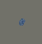

| ASCII-Zeichen | Beschreibung | Bild | ASCII-Hex-Code |
| - | - | - | - |
| `L` | Abgrund |  | `4c` |
| `X` | Wandblock |  | `58` |
| `=` | Wand horizontal |  | `3d` |
| `#` | Wand vertikal |  | `23` |
| `*` | Saeule mit Lichtquelle |  | `2a` |
| ` ` | Bodenplatte normal |  | `20` |
| `.` | Bodenplatte weisz |  | `e3` |
| `O` | Bodenplatte Default-Bot-Startpunkt |  | `30` |
| `1` | Bodenplatte Startpunkt Bot1 |  | `31` |
| `2` | Bodenplatte Startpunkt Bot2 |  | `32` |
| `Z` | Bodenplatte Bot-Zielpunkt |  | `5a` |
| `o` | Bodenplatte mit Transportfach-Objekt |  | `6f` |
| `l` | Bodenplatte mit Bot Positioning System (BPS)-Landmarke |  | `6c` |
| <code>&#124;</code> | Bodenplatte mit Linie vertikal |  | `7C` |
| `$` | Bodenplatte mit Linie vertikal als Startpunkt Bot1 |  /  | `24` |
| `!` | Bodenplatte mit Linie vertikal unterbrochen |  | `21` |
| `-` | Bodenplatte mit Linie horizontal |  | `2d` |
| `%` | Bodenplatte mit Linie horizontal unterbrochen |  | `25` |
| `/` | Bodenplatte mit Linie Ecke NW |  | `2f` |
| `\` | Bodenplatte mit Linie Ecke NE |  | `5c` |
| `+` | Bodenplatte mit Linie Ecke SW |  | `2b` |
| `~` | Bodenplatte mit Linie Ecke SE |  | `7e` |
| `[` | Bodenplatte mit Linie Kreuzung +-Form |  | `5b` |
| `T` | Bodenplatte mit Linie Kreuzung T-Form |  | `54` |
| `}` | Bodenplatte mit Linie Kreuzung T-Form 90° gegen UZS |  | `7d` |
| `{` | Bodenplatte mit Linie Kreuzung T-Form 90° mit UZS |  | `7b` |
| `]` | Bodenplatte mit Linie Kreuzung T-Form kopfstehend |  | `5d` |
| `(` | Bodenplatte mit Linie vertikal und Transportfach-Objekt |  | `28` |
| `_` | Bodenplatte mit Linie horizontal und Transportfach-Objekt |  | `5f` |
| `p` | Bodenplatte mit Linie Ecke NW und Transportfach-Objekt |  | `70` |
| `q` | Bodenplatte mit Linie Ecke NE und Transportfach-Objekt |  | `71` |
| `b` | Bodenplatte mit Linie Ecke SW und Transportfach-Objekt |  | `62` |
| `d` | Bodenplatte mit Linie Ecke SE und Transportfach-Objekt |  | `64` |

Möglich, daher für Erweiterunggen verfügbar, sind alle [ASCII "Printable Characters"](https://en.wikipedia.org/wiki/ASCII#Printable_characters).

ACHTUNG: Die Liste bei Änderungen/Erweiterung in 
- `ctSim/model/ParcoursLoader.java`
und
- `ctSim/parcours/template.xml`
bitte ebenfalls aktualisieren!

Siehe auch:

* https://www.heise.de/ct/artikel/Genesis-290480.html
* `ctSim/model/ParcoursLoader.java`
* `ctSim/parcours/template.xml`
* `ctSim/parcours/fotostudio.xml`

Autor: anonybot@riseup.net (2018-12-08)
